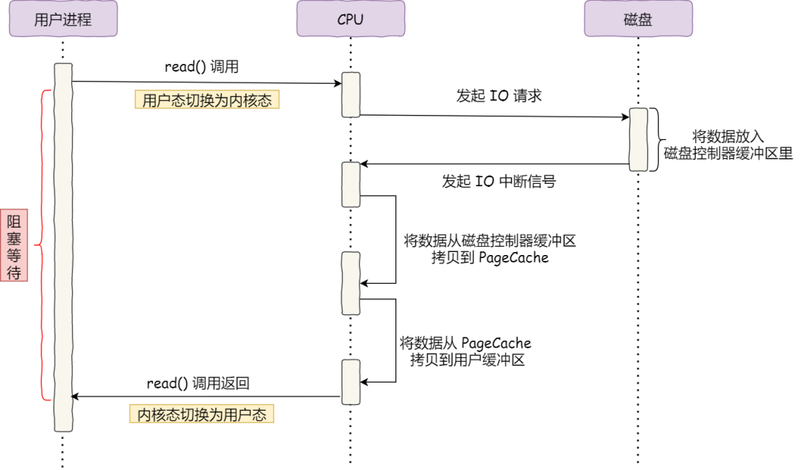
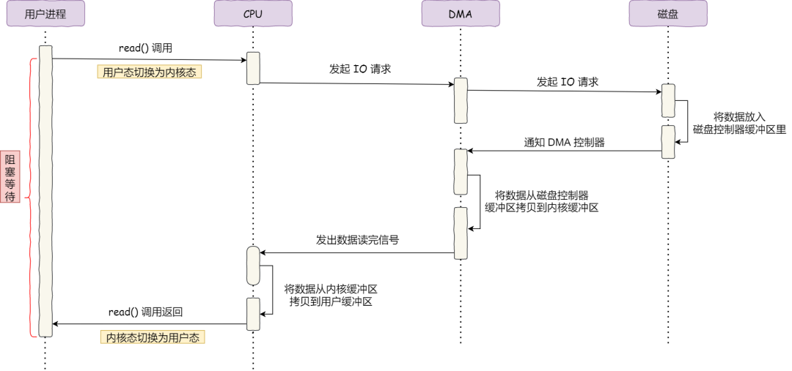
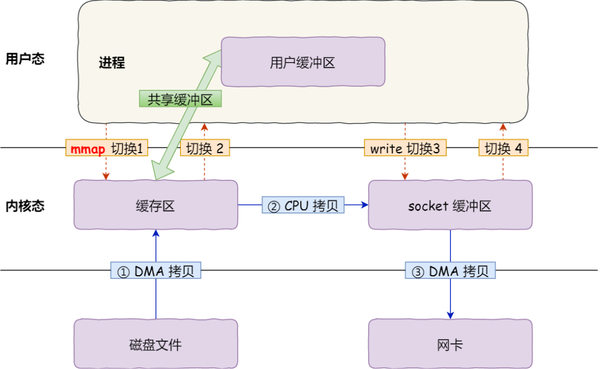
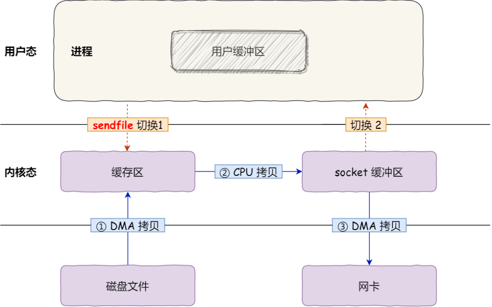
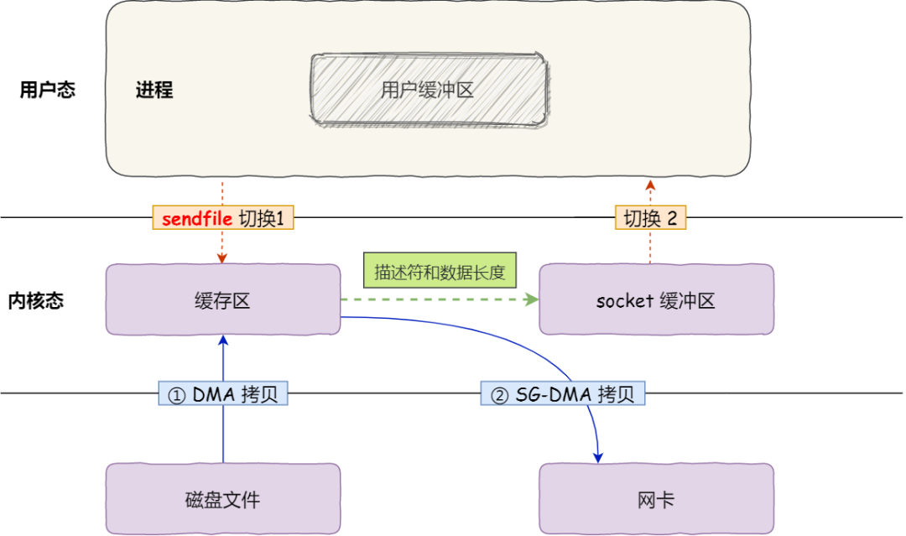

## 零拷贝
* 无DMA

  

* DMA
  直接内存访问（Direct Memory Access） 技术

在进行 I/O 设备和内存的数据传输的时候，数据搬运的工作全部交给 DMA 控制器，而 CPU 不再参与任何与数据搬运相关的事情，这样 CPU 就可以去处理别的事务。

  

* 传统文件传输

  read(file, tmp_buf, len);

  write(socket, tmp_buf, len);

  

* 零拷贝

  mmap + write

  

  sendfile

  

  网卡支持 SG-DMA（The Scatter-Gather Direct Memory Access）技术

  

零拷贝技术可以把文件传输的性能提高至少一倍以上。

*「内核缓冲区」实际上是磁盘高速缓存（PageCache）
  * PageCache 来缓存最近被访问的数据
  * PageCache 使用了「预读功能」
  * 但是，在传输大文件（GB 级别的文件）的时候，PageCache 会不起作用，那就白白浪费 DRM 多做的一次数据拷贝，造成性能的降低，即使使用了 PageCache 的零拷贝也会损失性能
  * 在高并发的场景下，针对大文件的传输的方式，应该使用「异步 I/O + 直接 I/O」来替代零拷贝技术。
