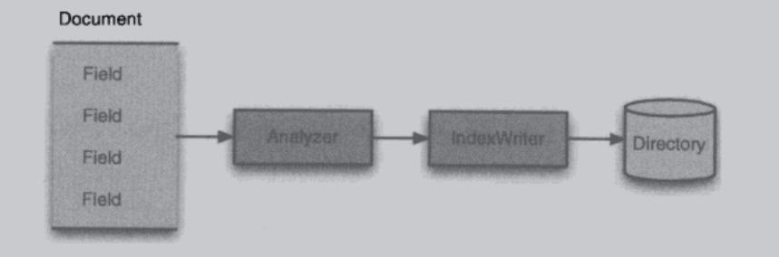

## 索引过程的核心类
### IndexWriter

* 索引过程的核心组件。这个类负责创建新索引或者打开已有索引，以及向索引中添加，删除或更新被索引文档的信息。
### Directory
### Analyzer
### Document
### Field

  

## 搜索过程的核心类
### IndexSearcher

* 用于搜索由IndexWriter类创建的索引：这个类公开了几个搜索方法，它是连接索引的中心环节。可以看作已只读方式打开索引的类。
### Term
### Query
### TermQuery
### TopDocs
